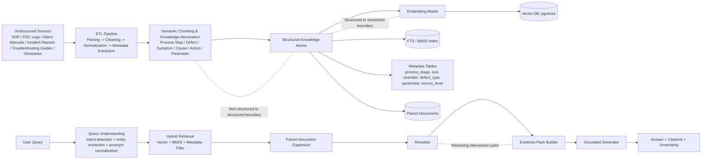

# Semiconductor Process Troubleshooting RAG Architecture

## 1. System Objective
本系統用於半導體製程異常分析與知識檢索輔助，目標不是取代製程工程師，而是提供：

1. 與異常現象相關的知識召回  
2. 缺陷可能成因的可解釋候選排序  
3. 基於證據的修正建議摘要  
4. 明確引用來源與不確定性揭露  

## 2. Architecture Overview
本系統採用以領域知識為核心的 RAG 架構，將半導體製程中的非結構化文件，透過 ETL、語義切分、知識原子化與 metadata 抽取，轉換為可供檢索與生成的知識單元。

在查詢階段，系統先對使用者問題進行 query understanding，包括意圖辨識、實體擷取與縮寫正規化，再透過 Hybrid Retrieval（結合向量檢索、BM25 與 metadata filter）召回候選內容，接著以 parent-document retrieval 與 reranker 提升上下文完整性與排序品質，最後由 grounded generator 依據 evidence pack 生成附帶 citation 與不確定性揭露的回答。

此架構特別強調三個關鍵邊界：

- 非結構化資料轉為結構化知識的邊界  
- 結構化知識轉為向量表示的邊界  
- reranking 模組介入檢索與生成之間的控制點  

### 2.1 Architecture Diagram

## 3. Data Ingestion (ETL)
資料來源包含：

- 製程操作手冊（SOP）
- 設備 alarm code 對照文件
- defect / failure 分析報告
- troubleshooting guide
- glossary 與 abbreviation list
- 工程變更紀錄（ECO / revision note）

ETL 階段包含：

1. PDF / Markdown / HTML 解析  
2. 去除頁首頁尾與重複段落  
3. 術語正規化（例如 CMP, Etch, CD, Overlay）  
4. 製程階段、工具名稱、缺陷代碼、參數名稱擷取  
5. 切分為語義完整 chunk 與 parent document  
6. 建立 embedding 與 metadata 索引  

## 4. Representation Strategy
最小索引單位不是固定長度文字，而是「知識原子」：

- process_step  
- symptom  
- defect_type  
- parameter  
- root_cause  
- corrective_action  
- warning  
- citation  

這樣可避免把一個完整的製程因果關係切碎後失真。

## 5. Retrieval Strategy
採用 Hybrid Retrieval：

- **Vector retrieval**：找語義相近的異常描述  
- **BM25 / keyword retrieval**：抓縮寫、型號、defect code、參數名  
- **Metadata filter**：依 process stage / tool / defect type 過濾  
- **Parent-document retrieval**：先用小 chunk 命中，再回收完整父文件上下文  
- **Reranker**：以 query 與證據相關度重新排序，降低語意近似但製程階段錯誤的結果  

## 6. Hallucination Control
- Answer 只能基於 evidence pack 生成  
- 若檢索證據不足，回覆「資料不足」  
- 若不同文件版本衝突，優先採最新 revision 與高權威來源  
- 回答需包含 citation 與 confidence note  

## 7. Storage Topology
- PostgreSQL + pgvector：主儲存與向量檢索  
- Full-text index：處理縮寫、代號、精準字串  
- Metadata tables：支援 structured filtering  
- Parent-document table：保存章節級上下文 

### 7.1 Physical Data Layout
為了讓 architecture 與後續 schema / SQL 一致，本系統將儲存層拆為四類結構：

1. `source_documents`
   - 保存文件來源、revision、authority level、language
2. `parent_documents`
   - 保存章節級上下文，支援 parent-document retrieval
3. `knowledge_atoms`
   - 保存最小檢索單位與 embedding vector
4. `term_aliases`
   - 保存縮寫、別名與 canonical term 對應，用於 query understanding 與 acronym normalization

此設計的目的在於確保：
- revision-aware retrieval 可被資料結構支持
- authority ranking 可被查詢與排序使用
- parent-document expansion 有明確對應表
- term disambiguation 不只停留在概念層 

## 8. Why This Architecture
半導體製程知識不是一般 FAQ。  
同一個 defect 名稱在不同 process stage、不同 tool family、不同 recipe window 下，可能對應完全不同的成因與修正動作，因此必須用結構化 metadata 與 reranking 控制召回品質。